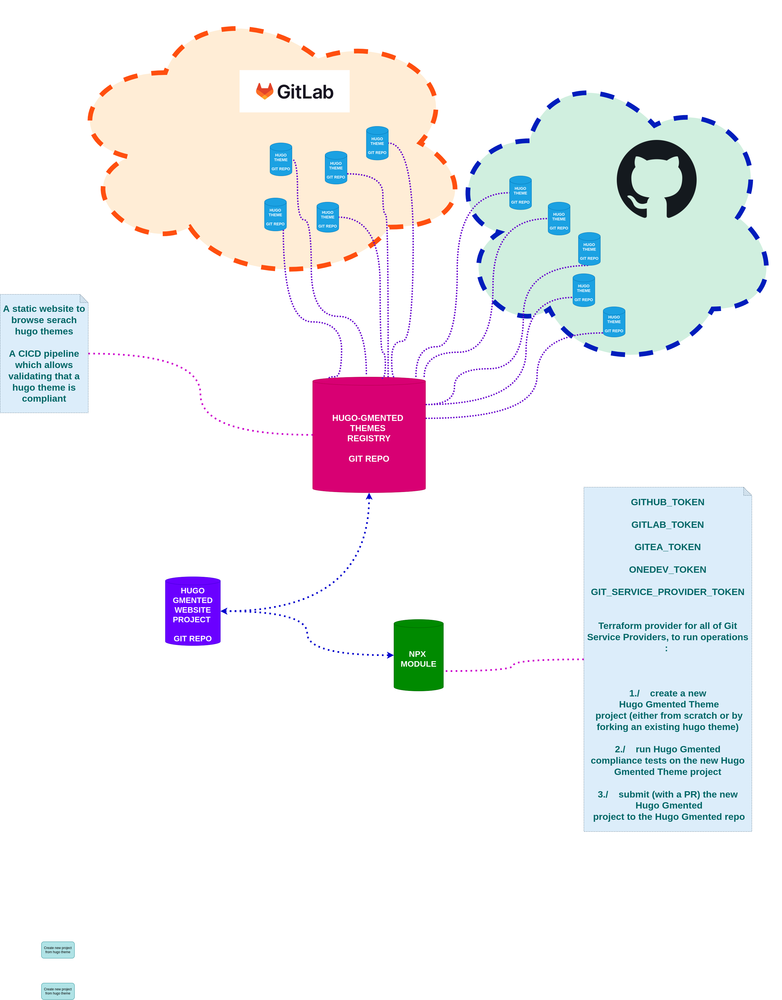

# The Hugo Gmented Registry

The `Hugo Gmented Registry` is a registry referencing all `Hugo Gmented`-compliant [Hugo](https://gohugo.io/) [Themes](https://themes.gohugo.io/)

## What is a `Hugo Gmented`-compliant Hugo Theme ?

## Use a `Hugo Gmented` Theme

## Submit your `hugo` theme

## Architecture

## Tech Stack

* `NodeJS` `16+`
* `Golang` `17+`
* The `bash` `B`ourne `A`gain `SH`ell, version above `GNU bash, version 4.4.12`
* The [`hugo`](https://gohugo.io/) extended cli,  version above `hugo v0.89.4-AB01BA6E+extended` (`AB01BA6E` is a git commit hash `--short`)

## See also

* A few weeks before created the registry, I created a git repo which kind of is the homo-erectus for the homo-sapiens-sapiens that the `Hugo Gmented Registry` is : https://github.com/pokusio/hugo-bunch
